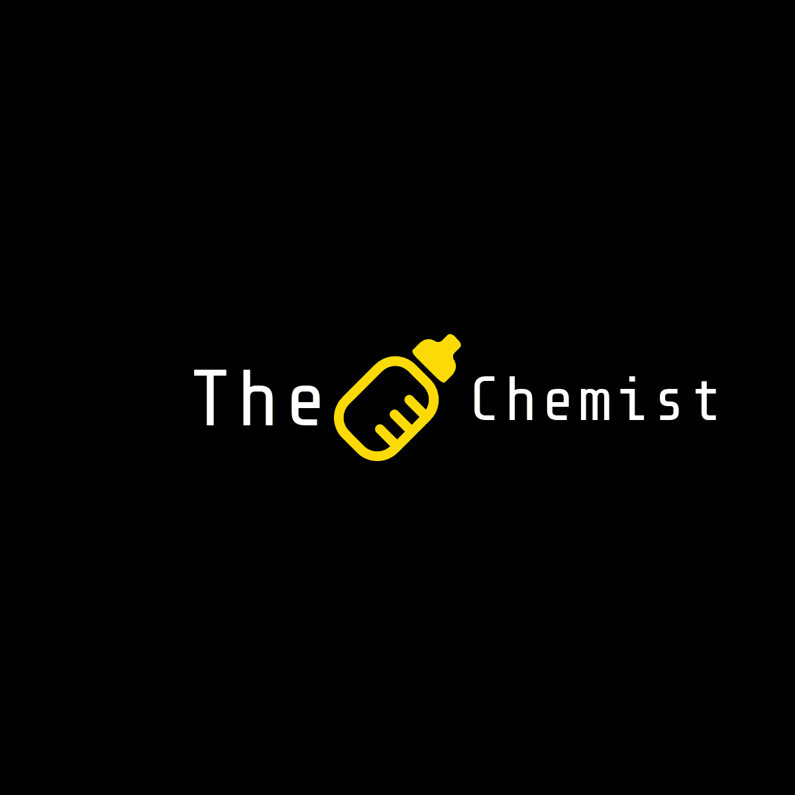

<!-- Massive Shoutout to othneildrew, douglascayers and DropNib 
*** for setting the foundations of this repo. Major credits to them! -->

<!--
*** To avoid retyping too much info. Do a search and replace for the following:
*** full_name, github_username, repo, adityasharma6, email, linkedin_url
-->


<!-- PROJECT SHIELDS -->
<!--
*** I'm using markdown "reference style" links for readability.
*** Reference links are enclosed in brackets [ ] instead of parentheses ( ).
*** See the bottom of this document for the declaration of the reference variables
*** for contributors-url, forks-url, etc. This is an optional, concise syntax you may use.
*** https://www.markdownguide.org/basic-syntax/#reference-style-links
-->
[![Contributors][contributors-shield]][contributors-url]
[![Forks][forks-shield]][forks-url]
[![Stargazers][stars-shield]][stars-url]
[![Issues][issues-shield]][issues-url]
[![MIT License][license-shield]][license-url]
[![LinkedIn][linkedin-shield]][linkedin-url]


<!-- PROJECT LOGO -->
<br />
<p align="center">
  <a href="https://github.com/AdityaSharma6/The-Chemist">
    
  </a>

  <h3 align="center">The Chemist</h3>

  <p align="center">
    Long gone are the laborous days of calculating for & solving Chemical Equations. 
    The Chemist is a simple Object Oriented Python program that solves 'em for you!
    <br />
    <a href="https://github.com/AdityaSharma6/The-Chemist"><strong>Explore the docs »</strong></a>
    <br />
    <br />
    <a href="https://github.com/AdityaSharma6/The-Chemist">View Demo</a>
    ·
    <a href="https://github.com/AdityaSharma6/The-Chemist/issues">Report Bug</a>
    ·
    <a href="https://github.com/AdityaSharma6/The-Chemist/issues">Request Feature</a>
  </p>
</p>


<!-- TABLE OF CONTENTS -->
## Table of Contents

* [About the Project](#about-the-project)
  * [Built With](#built-with)
* [Getting Started](#getting-started)
  * [Prerequisites](#prerequisites)
  * [Installation](#installation)
* [Usage](#usage)
* [Roadmap](#roadmap)
* [Contributing](#contributing)
* [License](#license)
* [Contact](#contact)
* [Acknowledgements](#acknowledgements)


<!-- ABOUT THE PROJECT -->
## About The Project

[![The Chemist's Introduction][product-screenshot]](https://example.com)


### Built With

* [Python](https://www.python.org/)
* [Doxygen](https://www.doxygen.nl/index.html)
* [Flake](https://flake8.pycqa.org/en/latest/)


<!-- GETTING STARTED -->
## Getting Started

To get a local copy up and running follow these simple steps.

### Prerequisites

This is an example of how to list things you need to use the software and how to install them.
* Dependency Installation
```sh
pip install requirements.txt
```

### Installation
 
1. Clone the repo
```sh
git clone https://github.com/AdityaSharma6/The-Chemist.git
```

<!-- USAGE EXAMPLES -->
## Usage

Use this space to show useful examples of how a project can be used. Additional screenshots, code examples and demos work well in this space. You may also link to more resources.

_For more examples, please refer to the [Documentation](https://github.com/AdityaSharma6/The-Chemist/)_

<!-- CONTRIBUTING -->
## Contributing

Contributions are what make the open source community such an amazing place to be learn, inspire, and create. Any contributions you make are **greatly appreciated**. 

What about making a GUI? That could be a good first step!

1. Fork the Project
2. Create your Feature Branch (`git checkout -b feature/AmazingFeature`)
3. Commit your Changes (`git commit -m 'Add some AmazingFeature'`)
4. Push to the Branch (`git push origin feature/AmazingFeature`)
5. Open a Pull Request


<!-- LICENSE -->
## License

Distributed under the MIT License. See `LICENSE` for more information.


<!-- CONTACT -->
## Contact

Aditya Sharma - [@adityasharma6](linkedin_url) - aditya_sharma_@hotmail.com

Project Link: [https://github.com/AdityaSharma6/The-Chemist](https://github.com/AdityaSharma6/The-Chemist)


<!-- ACKNOWLEDGEMENTS -->
## Acknowledgements

* [othneildrew](https://github.com/othneildrew/Best-README-Template)
* [Professor W. Spencer Smith](https://gitlab.cas.mcmaster.ca/smiths/se2aa4_cs2me3)
* [Jackson Cooper](https://github.com/jacks0n)


<!-- MARKDOWN LINKS & IMAGES -->
<!-- https://www.markdownguide.org/basic-syntax/#reference-style-links -->
[contributors-shield]: https://img.shields.io/github/contributors/AdityaSharma6/The-Chemist.svg?style=flat-square

[contributors-url]: https://github.com/AdityaSharma6/The-Chemist/graphs/contributors

[forks-shield]: https://img.shields.io/github/forks/AdityaSharma6/The-Chemist.svg?style=flat-square

[forks-url]: https://github.com/AdityaSharma6/The-Chemist/network/members

[stars-shield]: https://img.shields.io/github/stars/AdityaSharma6/The-Chemist.svg?style=flat-square

[stars-url]: https://github.com/AdityaSharma6/The-Chemist/stargazers

[issues-shield]: https://img.shields.io/github/issues/AdityaSharma6/The-Chemist.svg?style=flat-square

[issues-url]: https://github.com/AdityaSharma6/The-Chemist/issues

[license-shield]: https://img.shields.io/github/license/AdityaSharma6/The-Chemist.svg?style=flat-square

[license-url]: https://github.com/AdityaSharma6/The-Chemist/blob/master/LICENSE.txt

[linkedin-shield]: https://img.shields.io/badge/-LinkedIn-black.svg?style=flat-square&logo=linkedin&colorB=555

[linkedin-url]: https://www.linkedin.com/in/adityasharma6/

[product-screenshot]: Readme_Images/screenshot.png
